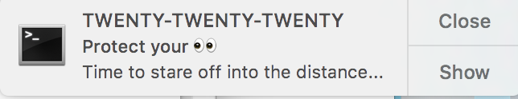

# O_o

Long hours of coding lead to eye strain. Optometrists recommend the twenty-twenty-twenty rule, which is to look 20
feet in the distance for 20 seconds every 20 minutes. Easier said than done. So to help out, this simple
python script, combined with a cron job, kicks off a MacOS notification reminder every 20 minutes.




## Getting started

### Prerequisites

These instructions are only for Mac OS and the script utilizes Python3. Here are excellent guides to installing
[Homebrew and Python3](https://docs.python-guide.org/starting/install3/osx/) as well as [Pip and Virtualenv](https://docs.python-guide.org/dev/virtualenvs/)

```
brew install terminal-notifier
```
Make a note of where brew installs terminal-notifier. This is important because this value is hardcoded in the python script. Not ideal, but cron jobs don't necessarily run from the same directory where the script is located, so using
relative paths does not work. Also, Cron doesn't like aliases in bashrc because the default shell option for
non-interactive shells is to not expand aliases. So update the `terminal_notifier_path` in the script for your environment.
```
pip install emoji
```
Only necessary, if you want to have some fun with emojis in your python script

### Crontab
If you don't have crontab already set up on your Mac, in Terminal run 'crontab -e`

This will open up vim with a new cronfile. In the file, add the below crontab making sure to replace the path to the
`O_o.py` script for your environment

```
*/20    07-17        *     * MON-FRI     /path/to/O_o.py
```

This cron job will run every 20 minutes from 7h00 to 17h00 on weekdays. When you save this update in vim, you should see
```
crontab: installing new crontab and you are all set
```
You can view all your crontabs with `crontab -l`

### Mac Notification Center
To enable notifications on Mac go to `System Preferences > Notifications > terminal-notifier`. Update
terminal-notifier alert style to `Alerts`
